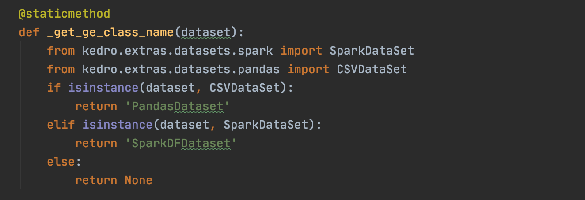

## Kedro Hooks integration with Great Expectations
In this example, we will integrate the Great Expectations plugin to Kedro using Hooks.

### Kedro Hooks
Allows the user to 'hook' several functionalities to their Kedro project in an easy and consistent manner.
For more details on Kedro Hooks, check out the [documentation](https://kedro.readthedocs.io/en/stable/07_extend_kedro/04_hooks.html).

### Great Expectations
Provides the ability to automatically profile and validate the data, as well as to generate documentation based on the expectations.
In this tutorial we will generate a JSON file with the expectations.
To learn more about Great Expectations, have a look at the [documentation page](https://docs.greatexpectations.io/en/stable/intro.html).  
 
> [NOTE: Explain why one would use them together]
 
#### Create Great Expectations project template
The following command will generate a new directory. The folder structure will be shown on the CLI upon execution.  
From the `src` folder, run:
```
great_expectations init
```
Type `y` and press enter.

Next step is to configure our data source. Type `y` on the next prompt. And `y` again.

For this project, we will use Pandas. Type `1` on the next prompt and `1` again.  

Enter the path for the folder where your data is stored. In this project, we will be using the `iter_penguins.csv`, hosted locally at `data/01_raw`.  

Following, the prompt will ask for a datasource short name. Enter your name of choice (I chose `pandas_penguins`) and `y` to confirm.  

Next prompt will ask about profiling, type `y`. Since the **.csv** file is in our datasource, typing `1` will return the list of files available. Type `1` to choose the file.  
The Expectations suite will create a folder path and save the expectations as a JSON file. The file will describe all the expectations which will be asserted on this dataset.  
> [NOTE: Add .gif with the process]

Typying `y` on the next prompt will open the GE documentation with the data profiling analysis on a browser page.  
The 'Walkthrough' window shown is great to get you more familiar with the suite setup.

### Link Kedro project to Great Expectations  
#### Create a Custom dataset
Under `src/<palmer_penguins>/hooks` create a python file. In this project, the file is named `great_expectations_hooks.py`. 
This file will hold the contents of a custom Dataset that will replicate the way Great Expectations generate the validators and runs the checks on the data types of the dataset. In this case, the check will be performed on both `pandas` and `Spark` datasets.  
The snippet of code below illustrates where the datatypes are described.  
  
For more information on how to write your own custom datasets, have a look at the [documentation](https://kedro.readthedocs.io/en/stable/07_extend_kedro/01_custom_datasets.html#).  

#### Add pandas and Spark datasets to `catalog.yml`
Add the `pandas` and `Spark` datasets to the catalog file from `data/01_raw`, as follows:  
```
pandas_penguins_data:
  type: pandas.CSVDataSet
  filepath: data/01_raw/penguins_iter.csv

spark_penguins_data:
  type: spark.SparkDataSet
  filepath: data/01_raw/penguins_iter.csv
  file_format: csv
  load_args:
    header: true 
```

#### Add nodes to `src/palmer_penguins/pipeline.py`  
Now, let's add the nodes to `pipelines.py`. 

```
"__ge_pipeline__": Pipeline([
            node(lambda x: x.show(), inputs='spark_penguins_data', outputs=None),
            node(lambda x: x.describe(), inputs='pandas_penguins_data', outputs=None),
        ]),
```

Your final `create_pipelines()` function will look like this:

```
def create_pipelines(**kwargs) -> Dict[str, Pipeline]:
    data_engineering_pipeline = de.create_pipeline()
    data_science_pipeline = ds.create_pipeline()

    return {
        "__ge_pipeline__": Pipeline([
            node(lambda x: x.show(), inputs='spark_penguins_data', outputs=None),
            node(lambda x: x.describe(), inputs='pandas_penguins_data', outputs=None),
        ]),
        "de": data_engineering_pipeline,
        "ds": data_science_pipeline,
        "__default__": data_engineering_pipeline + data_science_pipeline,
    }
```

Now, let's run `great_expectations docs build` to check the output on the data validation.


#### Create Datasource for PySpark dataset
On terminal type:
```bash
great_expectations datasource new
``` 

Followed by `1` for file, `2` for PySpark. Specify the path for the datafile, which here will be `data/01_raw`.
And the datasource name `spark_data`. 

#### Create a new GE suite
On terminal type:  

```bash
great_expectations suite new
```  

Followed by `2` for Spark data and `1` and select the file on disc, option `1`. Name the new Expectation suite, here `spark_penguins_data`.  

The final `y` will open a notebook with the expectations for the data.  

This will create a new expectation. You can edit that expectation on a Jupyter notebook. Moreover, you can always access that notebook by typing `great_expectations suite edit`

[This should generate...](finish the tutorial!)

_________ Stopped writing the docs here - still needs some tidying __________


This is the end of the tutorial.

If you are interested on knowing more about the integration between Kedro and Great Expectations, have a look at `kedro-great`,
a [Python plugin](https://pypi.org/project/kedro-great/) desinged by [Tam-Sanh Nguyen](https://pypi.org/user/tamu/) to facilitate the integration between Kedro and GE.

_"Hold yourself accountable to Great Expectations. Never have fear of data silently changing ever again."_

